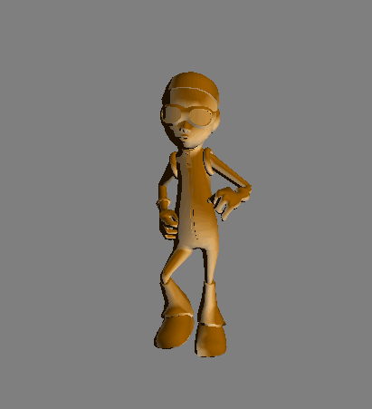

## Description 

This is a tutorial project created by me to support a lecture I gave to final year computer games programming students (De Montfort University) on how to import and animate a model using skeletal animation in C++ using OpenGL and GLSL for rendering. The model vertices and animation keyframe data is imported using Assimp. 

Developed in Visual Studio 2015. 

## Dependencies

-GLFW 
-glm 
-Assimp

## Preview 

## Credit 

OGLDEV 
